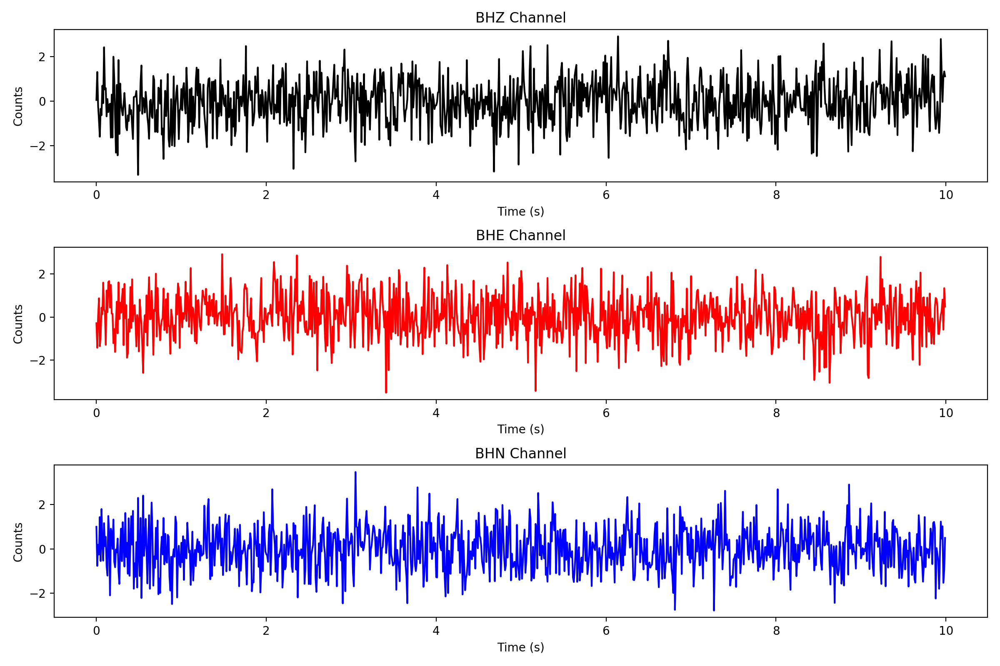

# mseed文件创建

## 头部中常见字段的解释

network: 网络代码，表示数据来自哪个网络或组织。

station: 台站代码，表示数据来自哪个地震台站。

location: 位置代码，用于区分同一台站内不同的位置或通道。

channel: 通道代码，表示数据采集的物理量和方向，如BHZ表示垂直地震记录。

starttime: 数据开始时间，表示数据采集的起始时间。

sampling_rate: 采样率，表示每秒采集的数据点数。

npts: 数据点数，表示地震波形数据的长度。

calib: 校准因子，用于将原始数据转换为真实的地震波形数据。

units: 数据单位，描述了数据的物理量和单位，如counts、m/s²等。

format: 数据格式，如INT32、FLOAT64等，表示数据的存储格式。

latitude 和 longitude: 台站的纬度和经度信息。

elevation: 台站的海拔高度。#
